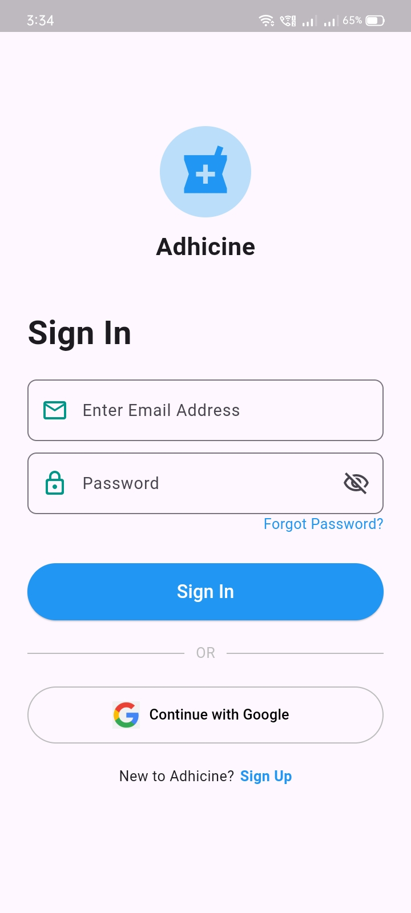
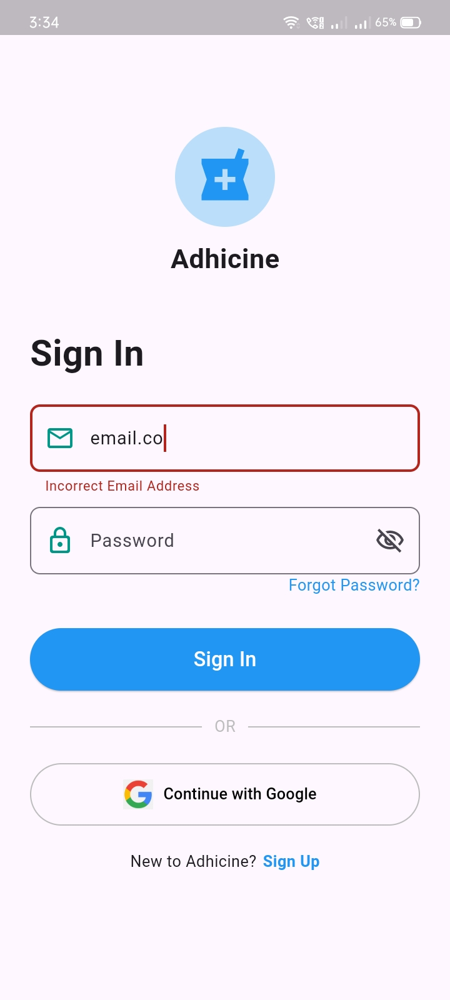
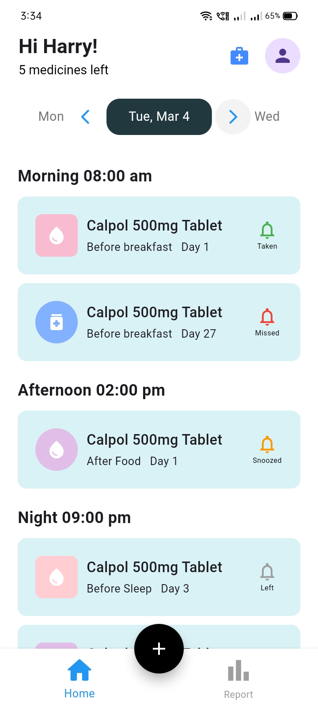
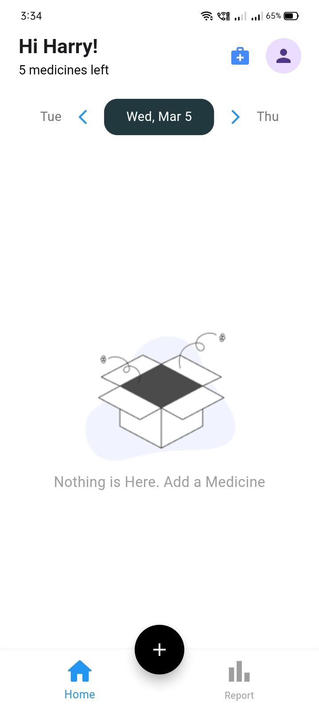
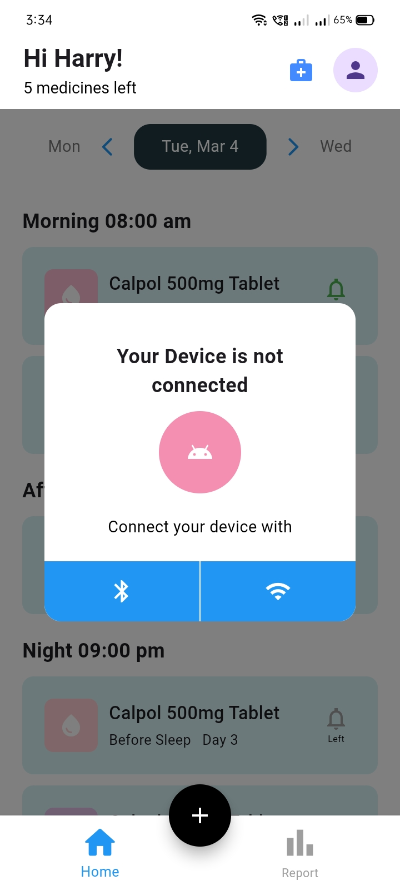
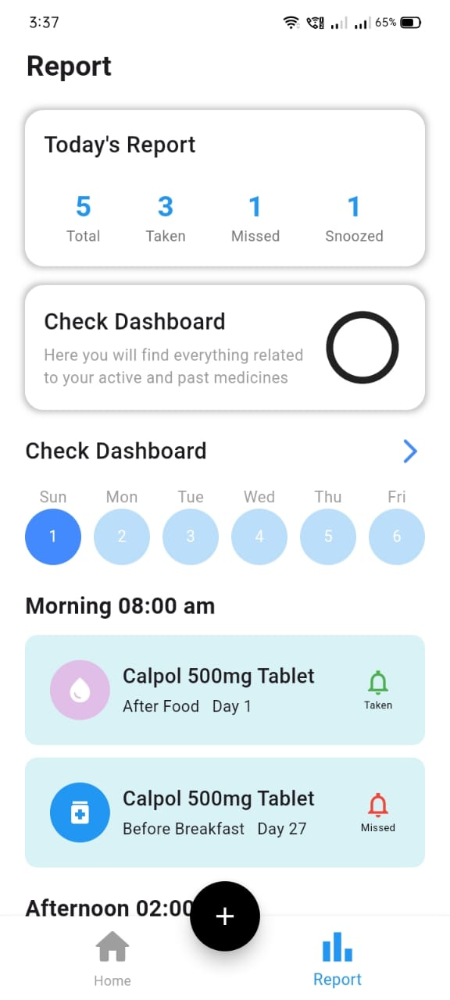
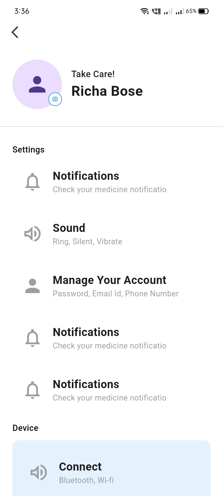
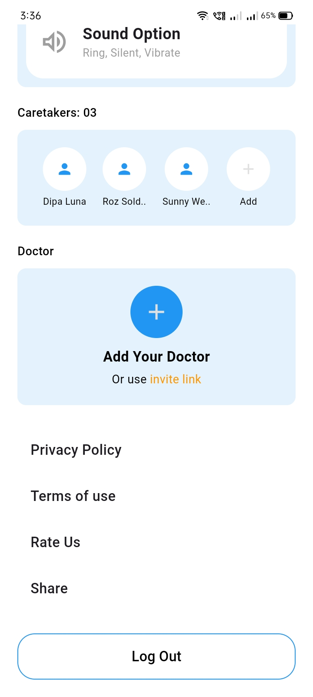
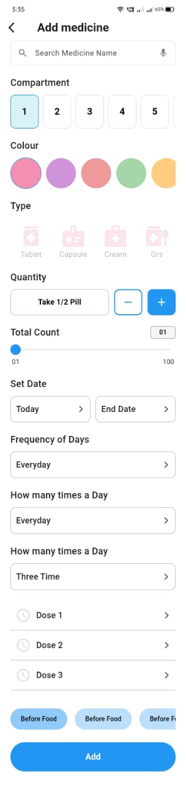

# medcare

to check email and password
email- rohit@gmail.com
password - 12345678

### Directory Details

- `assets/`: Stores static resources such as images, icons, and fonts (to be declared in `pubspec.yaml`).
- **`lib/`**:

  - `main.dart`: The main entry file where the app is initialized and the root widget is defined.
  - `screens/`: Contains all screen-specific directories and files:

    - `addMedicinePage/`: Directory for the add medicine page.

      - `widget/`: Contains widgets for the add medicine page.

        - `color_selector.dart`: Widget for color selection.
        - `compartment_selector.dart`: Widget for compartment selection.

      - `add_medicine.dart`: Add Medicine Screen

    - `HomeContent/`: Directory for home content.
      - `Widget/`: Contains widgets for home content.
        - `datepicker.dart`: Date picker widget.
        - `device_connection_popup.dart`: Popup widget for device connection.
      - `home_content.dart`: Main home content file.
    - `ReportPage/`: Directory for the report page.
      - `report_page.dart`: Report page implementation.
    - `SignInPage/`: Directory for the sign-in page.
      - `sign_in_screen.dart`: Sign-in screen implementation.
    - `UserInfoPage/`: Directory for the user info page.
      - `user_info_screen.dart`: User info screen implementation.
    - `homescreen.dart`: Main home screen file.

  - `utils/`: Contains utility widgets and components.
    - `card_tile.dart`: Reusable card tile widget.

- `pubspec.yaml`: Configuration file for dependencies, assets, and Flutter settings.
- `README.md`: This file, providing an overview, structure, and setup instructions for the project.

## Video

<video width="500" controls>
  <source src="assets/images/vid.mp4.mp4" type="video/mp4">
  Your browser does not support the video tag.
</video>

## Singin Page

  
  

## Home Page

  
  

  

## Report Page

  

## User Page

  
  

## add Page

  

